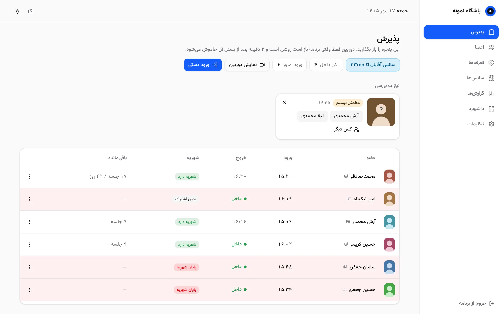

<div dir="rtl">

# Gym App

برنامه‌ی رایگان و متن‌باز مدیریت باشگاه. یه وبکم معمولی بذارید بالای جاکفشی؛ هر کی بیاد، برنامه از روی چهره می‌شناسدش، ورودش رو ثبت می‌کنه و با صدا بهش خوش‌آمد می‌گه. اگه شهریه‌اش تموم شده باشه هم همون‌جا اعلام می‌کنه. همه‌چی روی کامپیوتر خود باشگاه و بدون اینترنت.

🌐 **سایت:** https://mbpmohsen.github.io/gym-app/

▶️ **امتحان آنلاین (بدون نصب):** https://mbpmohsen.github.io/gym-app/demo/

⬇️ **دانلود برای ویندوز:** [آخرین نسخه](https://github.com/mbpmohsen/gym-app/releases/latest)



## چی کار می‌کنه؟

- **حضور و غیاب خودکار:** ورود و خروج با چهره ثبت می‌شه و یه جلسه از اشتراک کم می‌شه. کارت و اثر انگشت لازم نیست.
- **اعلام صوتی:** «خوش اومدی»، «شهریه‌ت تموم شده» یا «الان سانس شما نیست»، با صدای آقا یا خانم.
- **اعضا و اشتراک‌ها:** جلسه‌ای، ماهانه، ترکیبی، یه روز در میون، با دوش یا کمد. پرداخت ناقص بدهی ثبت می‌شه.
- **سانس‌بندی:** سانس آقایون و خانم‌ها، با هشدار برای کسی که تو سانس اشتباه بیاد.
- **گزارش و اکسل:** درآمد، ورودها، اشتراک‌های رو به اتمام، بدهکارها، غایب‌ها و ساعت‌های شلوغ، به‌علاوه‌ی خروجی شماره‌ها برای پیامک.
- **داشبورد:** آمار امروز و یه ماه اخیر در یه نگاه.
- **حریم خصوصی:** از چهره‌ها عکس نگه نمی‌داره، چیزی به اینترنت نمی‌فرسته و دوربین فقط وقتی برنامه بازه روشنه.

پیش‌نیاز: ویندوز ۱۰ یا ۱۱ و یه وبکم معمولی. تاریخ‌ها شمسی و مبلغ‌ها به تومان هستن.

## برای برنامه‌نویس‌ها

| پوشه | محتوا |
|---|---|
| [`docs/SPEC.md`](docs/SPEC.md) | مشخصات کامل: مدل داده، قواعد کسب‌وکار، صفحه‌ها، مراحل |
| [`face-service/`](face-service/) | سرویس تشخیص چهره (Rust + ONNX Runtime) |
| `assets/voices/` | فایل‌های صوتی اعلام ورود، خروج و پایان شهریه (مرد / زن) |
| [`server/`](server/) | سرور اصلی (Rust + SQLite)؛ UI و صداها داخل exe جاسازی می‌شن |
| `web/` | رابط کاربری (React + TypeScript + Vite) |
| `installer/` | نصب‌کننده‌ی ویندوز (Inno Setup) |
| `spikes/` | آزمایش‌های دورریختنی (پخش صدا) |

## ساخت نصب‌کننده (ویندوز)

پیش‌نیازها: Rust (MSVC)، Node.js و [Inno Setup 6](https://jrsoftware.org/isinfo.php) (`winget install JRSoftware.InnoSetup`). ONNX Runtime و مدل‌ها رو `installer/fetch-deps.ps1` دانلود می‌کنه.

```powershell
powershell -ExecutionPolicy Bypass -File installer\fetch-deps.ps1
powershell -ExecutionPolicy Bypass -File installer\build.ps1
```

خروجی: `installer\Output\GymApp-Setup-<نسخه>.exe`

نصب‌کننده:
- برنامه‌ها رو در `C:\Program Files\GymApp` و داده‌ها رو در `C:\ProgramData\GymApp` می‌ذاره (به‌روزرسانی و حذف، داده رو دست نمی‌زنه؛ موقع حذف می‌پرسه)
- دو سرویس ویندوز `FaceService` و `GymServer` رو نصب و اجرا می‌کنه (با ویندوز بالا میان، بعد از crash دوباره اجرا می‌شن)
- میانبر دسکتاپ می‌سازه که برنامه رو در پنجره‌ی مستقل Edge باز می‌کنه
- لاگ‌ها: `C:\ProgramData\GymApp\*\data\logs`

**پشتیبان‌گیری:** کل پوشه‌ی `C:\ProgramData\GymApp` (اول هر دو سرویس رو از services.msc متوقف کنید).

## انتشار نسخه

```bash
git tag v1.0.0 && git push origin v1.0.0
```

workflow‏ `release` روی ویندوزِ GitHub همه‌چی رو می‌سازه (ONNX Runtime و مدل‌ها رو هم خودش دانلود می‌کنه) و `GymApp-Setup-1.0.0.exe` رو همراه SHA256 توی Releases می‌ذاره.

## سایت و دمو

`site/` صفحه‌ی معرفیه و `web` توی حالت دمو (`npm run build:demo`) کل برنامه رو بدون سرور و با اطلاعات ساختگی توی مرورگر اجرا می‌کنه. workflow‏ `pages` با هر push روی main هر دو رو روی GitHub Pages منتشر می‌کنه (فقط یه بار: Settings ← Pages ← Source: GitHub Actions).

</div>
